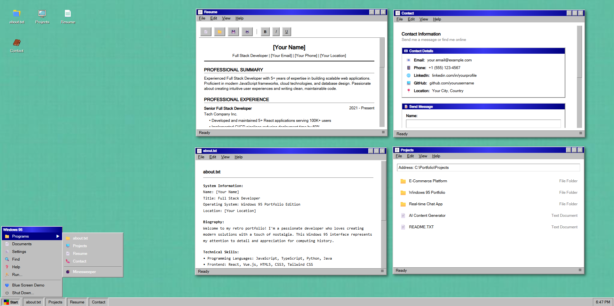

# Windows 95 Portfolio Experience

[](https://reactjs.org/)
[](https://www.typescriptlang.org/)
[](https://vitejs.dev/)
[](https://tailwindcss.com/)
[](https://ui.shadcn.com/)

A nostalgic Windows 95-style interactive portfolio website built with modern web technologies. This project recreates the classic Windows 95 desktop environment as a personal portfolio showcase, complete with interactive windows, desktop icons, and the iconic taskbar.



## 🌟 Features

- **Authentic Windows 95 UI**: Meticulously recreated Windows 95 aesthetic with pixel-perfect attention to detail
- **Interactive Desktop**: Functional desktop with draggable windows and clickable icons
- **Start Menu**: Classic Windows 95 Start Menu with animated transitions
- **Multiple Applications**: Portfolio content displayed as various "applications" in the Windows 95 environment
  - About Me
  - Resume
  - Projects
  - Contact
  - Minesweeper (playable!)
- **Responsive Design**: Optimized for various screen sizes while maintaining the Windows 95 look and feel
- **Modern Tech Stack**: Built with React, TypeScript, and Vite for a smooth, modern development experience

## 🚀 Getting Started

### Prerequisites

- Node.js (v16+)
- npm or yarn

### Installation

```bash
# Clone the repository
git clone https://github.com/jeppehvi/win95-portfolio.git

# Navigate to the project directory
cd win95-portfolio

# Install dependencies
npm install
# or
yarn install

# Start the development server
npm run dev
# or
yarn dev
```

Visit `http://localhost:5173` in your browser to see the application running.

## 🛠️ Tech Stack

- **Frontend Framework**: React with TypeScript
- **Build Tool**: Vite
- **Styling**: Tailwind CSS with custom CSS for Windows 95 aesthetics
- **UI Components**: shadcn/ui (modified for Windows 95 style)
- **State Management**: React Context API
- **Window Management**: Custom draggable window implementation

## 📁 Project Structure

```
win95-portfolio/
├── public/              # Static assets
├── src/
│   ├── assets/          # Project-specific assets (icons, wallpaper)
│   ├── components/      # React components
│   │   ├── ui/          # Base UI components (shadcn)
│   │   └── windows/     # Portfolio "application" windows
│   ├── contexts/        # React contexts for global state
│   ├── hooks/           # Custom React hooks
│   ├── lib/             # Utility functions
│   ├── pages/           # Top-level page components
│   ├── App.tsx          # Main application component
│   ├── index.css        # Global styles
│   └── main.tsx         # Application entry point
└── ...                  # Configuration files
```

## 🎮 Usage

1. **Desktop Interface**: Click on desktop icons to open different "applications"
2. **Window Management**: Drag windows by their title bars, minimize/maximize/close with window controls
3. **Start Menu**: Access all applications through the Start Menu by clicking the Windows logo
4. **Taskbar**: Track open windows and quickly switch between them

## 📝 Customization

This portfolio is designed to be easily customizable:

1. **Personal Information**: Update content in the `windows/` components
2. **Styling**: Modify colors and themes in `index.css`
3. **Desktop Icons**: Add or remove icons by editing `Desktop.tsx`
4. **Add New Windows**: Create new components in the `windows/` directory and integrate them with the window management system

## 🤝 Contributing

Contributions are welcome! Feel free to open issues or submit pull requests.

1. Fork the repository
2. Create your feature branch (`git checkout -b feature/amazing-feature`)
3. Commit your changes (`git commit -m 'Add some amazing feature'`)
4. Push to the branch (`git push origin feature/amazing-feature`)
5. Open a Pull Request

## 📜 License

This project is licensed under the MIT License - see the LICENSE file for details.

## 📬 Contact

Jeppe - [@jappehv](https://github.com/jeppehvi)

Project Link: [https://github.com/jeppehvi/win95-portfolio](https://github.com/jeppehvi/win95-portfolio)

---

<p align="center">
  Made with 💾 and nostalgia for the 90s
</p>
